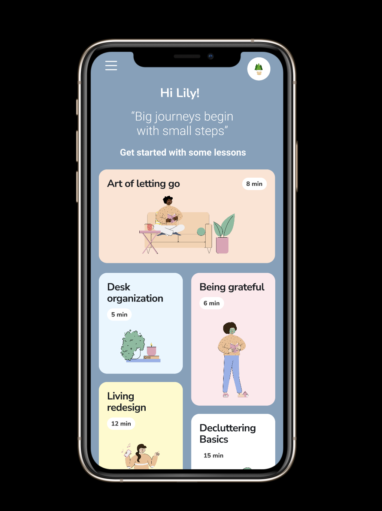

# BinHub

BinHub is a mobile app prototype solution designed at INFO 360:Design Thinking course at the University of Washington iSchool.

This repository contains the *Figma prototype*, *Prototype demo video* and a *presentation deck* that better explain the project. 

Click image below to view demo video

Here is the link to the interactive [prototype](https://www.figma.com/proto/I5FpiOOrodw7fd5TVBuhk5/Untitled?node-id=285%3A1466&scaling=scale-down&page-id=0%3A1&starting-point-node-id=301%3A4114)

